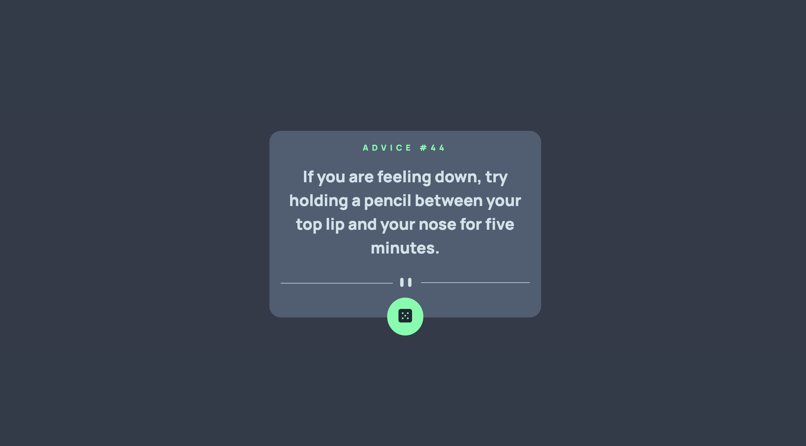

# Frontend Mentor - Advice generator app solution

This is a solution to the [Advice generator app challenge on Frontend Mentor](https://www.frontendmentor.io/challenges/advice-generator-app-QdUG-13db)

## Table of contents
- [Screenshot](#screenshot)
- [Links](#links)
- [My process](#my-process)
  - [Built with](#built-with)
- [Author](#author)

- 

### Screenshot

### Links

- Live Site URL: [Add live site URL here](https://jbutlerola-advice-generator.netlify.app)

## My process

### Built with

- Semantic HTML5 markup
- Flexbox
- Mobile-first workflow
- [React](https://reactjs.org/) - JS library

## Author

- Website - [Add your name here](https://jackbutler.dev)
- Frontend Mentor - [@yourusername](https://www.frontendmentor.io/profile/jbutlerola)

